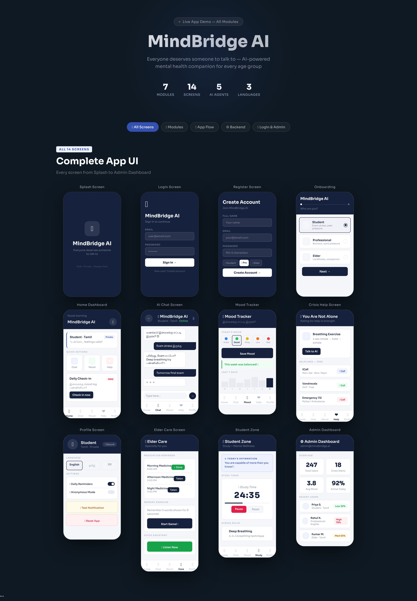

# 🧠 MindBridge AI — Mental Health Companion App

> *Everyone deserves someone to talk to.*

MindBridge AI is a personalized mental health companion app built for India — supporting Students, Professionals, Elders, Homemakers, and Teenagers in Tamil, English, and Hindi.

---

## 📸 Screenshots



> Complete app UI — 14 screens across 7 modules

| 7 | 14 | 5 | 3 |
|:---:|:---:|:---:|:---:|
| **Modules** | **Screens** | **AI Agents** | **Languages** |

---

## 📋 Project Overview

MindBridge AI is an AI-powered mobile application that provides:
- **24/7 emotional support** through an empathetic AI chat companion
- **Mood tracking & analytics** with burnout detection
- **Personalized experience** based on user type and language
- **Crisis detection** with automatic helpline suggestions
- **Proactive alerts** when mood declines over 3+ days
- **Complete privacy** — data never shared with employers or family without consent

---

## ✨ Features

### Module 1 — Core AI Chat
- LangGraph-powered multi-agent conversation flow
- Groq AI (LLaMA 3.1) for fast, empathetic responses
- Tamil / English / Hindi language support
- Crisis keyword detection with automatic helpline routing

### Module 2 — RAG Memory System
- Conversation history stored locally (last 30 messages)
- Context-aware responses based on past conversations
- Keyword search across chat history
- Personalized replies using user's past experiences

### Module 3 — Advanced Analytics
- Burnout score calculator (0–100 risk assessment)
- Weekly AI-generated mental health reports
- Mood trend detection (Improving / Declining / Stable)
- Proactive alert system for 3-day low mood patterns

### Module 4 — Elder Specific Features
- Medication reminder tracker
- Memory exercise games (Tamil & English)
- Voice-first interface using expo-speech
- Family summary generation (daily AI report for family)

### Module 5 — Student Specific Features
- Exam season auto-detection
- Pomodoro study timer (25 min study + 5 min break)
- Stress level tracker with personalized tips
- Campus mental health resources & helplines
- Anonymous mode for private conversations

### Module 6 — Professional Specific Features
- Work hours pattern tracking
- Burnout score with color-coded risk levels
- Work-life balance suggestions
- Quick 5-minute mindfulness sessions
- 100% anonymous — employer never notified

### Module 7 — Social Features
- Gratitude journal with streak tracking
- Daily affirmations (Tamil & English)
- Milestone & achievement badge system
- Streak tracker with celebration animations

---

## 🛠 Tech Stack

### Frontend
| Technology | Usage |
|-----------|-------|
| React Native (Expo SDK 56) | Mobile app framework |
| Expo Router | Navigation |
| AsyncStorage | Local data storage |
| expo-notifications | Push notifications |
| expo-speech | Voice output for elders |
| Axios | API calls |

### Backend
| Technology | Usage |
|-----------|-------|
| Python 3.13 | Backend language |
| FastAPI | REST API framework |
| LangGraph | Multi-agent AI orchestration |
| Groq AI (LLaMA 3.1) | AI language model |
| Uvicorn | ASGI server |
| python-dotenv | Environment variables |

### Infrastructure
| Technology | Usage |
|-----------|-------|
| EAS Build | Mobile app building |
| GitHub | Version control |
| JSON Files | Local data storage |

---

## 🚀 Installation Steps

### Prerequisites
- Node.js 18+
- Python 3.10+
- Expo CLI
- EAS CLI
- Groq API Key (console.groq.com)

---

### Frontend Setup

```bash
# 1. Clone the repository
git clone https://github.com/Gugapreethi/MindBridgeAI.git
cd MindBridgeAI/MindBridgeAI-Frontend

# 2. Install dependencies
npm install

# 3. Create environment file
# Create utils/config.js and add your Groq API key:
# export const CONFIG = { GROQ_API_KEY: 'your_key_here' };

# 4. Start development server
npx expo start --dev-client

# 5. Build APK (for standalone use)
eas build --profile preview --platform android
```

---

### Backend Setup

```bash
# 1. Navigate to backend folder
cd MindBridgeAI/MindBridgeAI-Backend

# 2. Create virtual environment
python -m venv venv

# 3. Activate virtual environment
# Windows:
venv\Scripts\activate
# Mac/Linux:
source venv/bin/activate

# 4. Install dependencies
pip install fastapi uvicorn groq langgraph python-dotenv

# 5. Create .env file
# Add: GROQ_API_KEY=your_groq_api_key_here

# 6. Start backend server
uvicorn main:app --reload --port 8000
```

---

## 🔌 API Endpoints

### Core
| Method | Endpoint | Description |
|--------|----------|-------------|
| GET | `/` | Health check |
| GET | `/health` | Server status |
| POST | `/chat` | Main AI chat |
| POST | `/mood` | Log mood score |

### Analytics (Module 3)
| Method | Endpoint | Description |
|--------|----------|-------------|
| GET | `/burnout/{user_id}` | Burnout score |
| GET | `/weekly-report/{user_id}` | Weekly AI report |
| GET | `/alert/{user_id}` | Proactive alert check |

### Elder (Module 4)
| Method | Endpoint | Description |
|--------|----------|-------------|
| GET | `/elder/medications/{user_id}` | Get medications |
| POST | `/elder/medication/taken` | Mark medication taken |
| GET | `/elder/memory-game` | Get memory game |
| POST | `/elder/memory-game/check` | Check game result |
| POST | `/elder/chat` | Elder AI chat |
| GET | `/elder/family-summary/{user_id}` | Family daily summary |

### Student (Module 5)
| Method | Endpoint | Description |
|--------|----------|-------------|
| GET | `/student/exam-season/{user_id}` | Exam season detect |
| POST | `/student/stress` | Log stress level |
| POST | `/student/study-session` | Log study session |
| GET | `/student/affirmation` | Daily affirmation |
| GET | `/student/resources` | Campus helplines |
| POST | `/student/chat` | Student AI chat |

### Professional (Module 6)
| Method | Endpoint | Description |
|--------|----------|-------------|
| POST | `/professional/work-hours` | Log work hours |
| GET | `/professional/burnout/{user_id}` | Professional burnout |
| GET | `/professional/suggestions/{user_id}` | Balance suggestions |
| GET | `/professional/session` | Quick 5-min session |
| POST | `/professional/chat` | Professional AI chat |

### Social (Module 7)
| Method | Endpoint | Description |
|--------|----------|-------------|
| POST | `/journal/save` | Save journal entry |
| GET | `/journal/{user_id}` | Get journal entries |
| POST | `/journal/reflect` | AI journal reflection |
| GET | `/affirmation` | Daily affirmation |
| GET | `/milestones/{user_id}` | User milestones |
| POST | `/milestones/unlock` | Unlock milestone |
| POST | `/streak/update` | Update streak |

---

## 📁 Folder Structure

```
MindBridgeAI/
│
├── mindbridge-demo.jpg               # App demo screenshot
├── README.md                         # This file
│
├── MindBridgeAI-Frontend/
│   ├── App.js                        # Main app entry point
│   ├── index.js                      # Expo entry
│   ├── app.json                      # Expo config
│   ├── eas.json                      # EAS build config
│   ├── package.json
│   │
│   ├── screens/
│   │   ├── SplashScreen.js           # Loading screen
│   │   ├── OnboardingScreen.js       # Registration/Login
│   │   ├── HomeScreen.js             # Dashboard
│   │   ├── ChatScreen.js             # AI Chat
│   │   ├── MoodTrackerScreen.js      # Mood logging
│   │   ├── CrisisScreen.js           # Emergency help
│   │   ├── ProfileScreen.js          # User profile
│   │   ├── ElderScreen.js            # Elder features
│   │   └── StudentScreen.js          # Student features
│   │
│   └── utils/
│       ├── api.js                    # Backend API calls
│       ├── storage.js                # AsyncStorage helpers
│       ├── notifications.js          # Push notifications
│       ├── theme.js                  # App theme colors
│       ├── strings.js                # Tamil/English strings
│       ├── voice.js                  # Text-to-speech
│       └── config.js                 # API keys (gitignored)
│
├── MindBridgeAI-Backend/
│   ├── main.py                       # FastAPI app + all routes
│   ├── graph.py                      # LangGraph workflow
│   ├── .env                          # API keys (gitignored)
│   │
│   ├── agents/
│   │   ├── orchestrator.py           # Main AI orchestrator
│   │   ├── listener_agent.py         # Empathy & response
│   │   ├── crisis_agent.py           # Crisis detection
│   │   ├── pattern_agent.py          # Mood pattern analysis
│   │   ├── care_network_agent.py     # Family alert system
│   │   ├── analytics_agent.py        # Burnout & reports
│   │   ├── elder_agent.py            # Elder features
│   │   ├── student_agent.py          # Student features
│   │   ├── professional_agent.py     # Professional features
│   │   └── social_agent.py           # Journal & milestones
│   │
│   ├── utils/
│   │   ├── memory.py                 # Conversation & mood storage
│   │   ├── models.py                 # Pydantic request models
│   │   └── prompts.py                # AI system prompts
│   │
│   └── data/
│       ├── conversations/            # User chat history (JSON)
│       ├── mood_history/             # Mood logs (JSON)
│       ├── summaries/                # Weekly reports (JSON)
│       ├── journals/                 # Gratitude journal (JSON)
│       └── milestones/               # Achievement data (JSON)
│
└── README.md
```

---

## 🔮 Future Enhancements

### Phase 2 — Planned Features
| Feature | Description |
|---------|-------------|
| 🔐 Authentication | Firebase / JWT login system |
| ☁️ Cloud Storage | MongoDB / PostgreSQL for data |
| 📱 iOS Support | Apple App Store deployment |
| 🌐 Web Dashboard | Family monitoring portal |
| 🩺 Doctor Connect | Therapist booking integration |
| 📊 Advanced Charts | Mood visualization graphs |

### Phase 3 — AI Enhancements
| Feature | Description |
|---------|-------------|
| 🎤 Voice Input | Speech-to-text conversation |
| 🌍 More Languages | Telugu, Malayalam, Kannada |
| 🤝 Group Support | Anonymous peer support groups |
| 📈 Predictive AI | Mental health risk prediction |
| 🏥 Hospital Integration | Connect with NIMHANS, iCall |
| 👨‍👩‍👧 Family App | Separate family monitoring app |

---

## 🔒 Privacy & Security

- ✅ All data stored locally on device
- ✅ No data shared with employers
- ✅ Anonymous mode available
- ✅ Care network alerts only with user consent
- ✅ API keys never committed to GitHub
- ✅ No ads, no tracking

---

## 📞 Mental Health Resources

| Organization | Number | Type |
|-------------|--------|------|
| iCall | 9152987821 | Mental Health |
| SAHAS | 1800-599-0019 | Counseling |
| Vandrevala Foundation | 18602662345 | 24/7 Support |
| NIMHANS | 080-46110007 | Psychiatry |

---

## 👩‍💻 Developer

**Gugapreethi A**
- GitHub: [@Gugapreethi](https://github.com/Gugapreethi)
- Project: MindBridge AI — Internship Project

---

## 📄 License

This project is built for educational and internship purposes.
Made with 💙 for India's mental health awareness.

---

> *"Your feelings are valid — you are never alone 💙"*
> — MindBridge AI